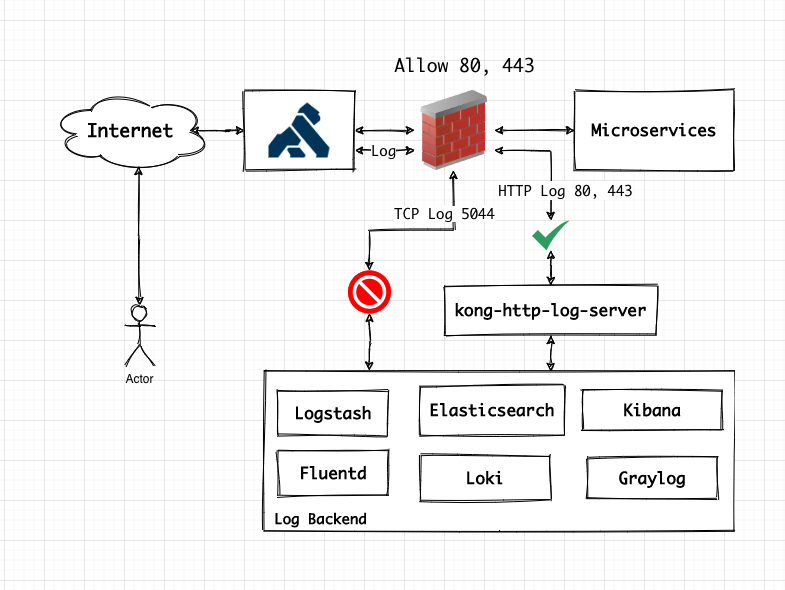

# kong-http-log-server

HTTP log server for Kong http-log plugin for Elasticsearch and more




# Why this project was born?

In some cases of running kong, we have logging server running but firewall or other policy of infrastructure didn’t allow kong connect to log server via TCP/UDP or Syslog, then kong-http-log-server was born

# Before start

Edit .env file

```
HOST=0.0.0.0
PORT=8080
ES_HOST=elasticsearch
ES_PORT=9200
INDEX_PATTERN=kong-2006-01-02
```

**NOTE :**

- `HOST` and `PORT` for http-es-log-server binding
- `ES_HOST` and `ES_PORT` for Elasticsearch Server
- `INDEX_PATTERN` use Golang date format

Ref: [https://gobyexample.com/time-formatting-parsing](https://gobyexample.com/time-formatting-parsing)


# Start 'em all

```
docker-compose up -d kong-database
docker-compose up migrations
docker-compose up -d kong elasticsearch kibana kong-http-log-server 
```

# Create sevice and route

```
curl http://127.0.0.1:8001/services -d name=httpbin -d url=http://httpbin.org
curl http://127.0.0.1:8001/services/httpbin/routes -d name=httpbin -d paths[]=/
```

# Add http-log plugin

```
curl http://127.0.0.1:8001/services/httpbin/plugins \
	-d name=http-log \
	-d config.http_endpoint=http://http-es-log-server:8080/
```

# Kibana

```
http://127.0.0.1:5601
```

# Start kong-http-log-server without docker

```
go run .
# or
go build .
./kong-http-log-server
```

## TODO
- [ ] Add [basic auth](https://echo.labstack.com/middleware/basic-auth) support via .env for kong-http-log-server
- [ ] Add [loki](https://grafana.com/oss/loki/) support
- [ ] Add [graylog](https://www.graylog.org/) support
- [ ] Add auth support for log backend
- [ ] Add more protocol support for log backend
	- [ ] Syslog
	- [ ] TCP
	- [ ] UDP
	

